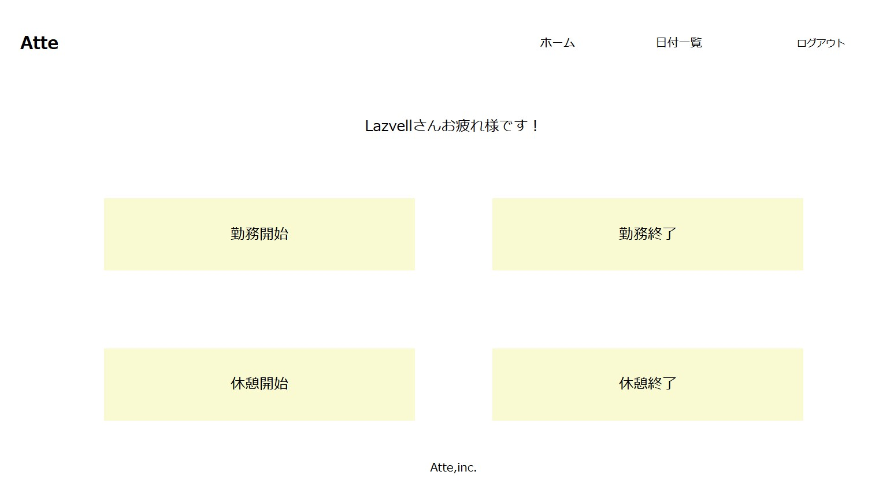
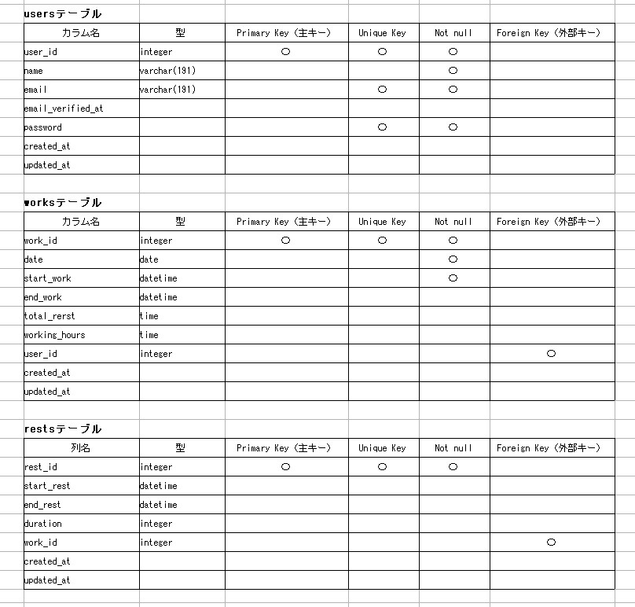
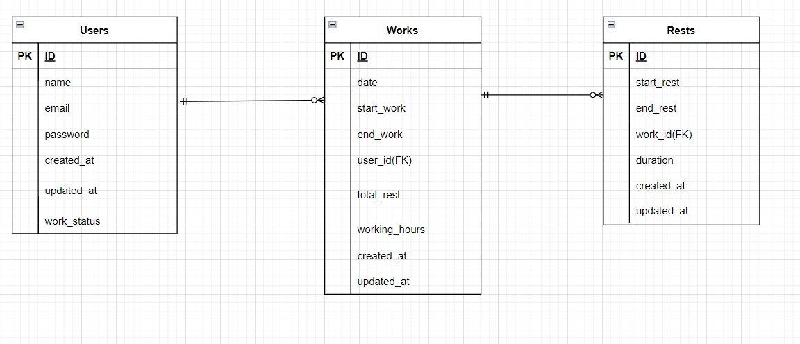

# アプリケーション名　Atte
概要：このアプリは従業員の勤務時間、休憩時間などを管理するツールです。

## 作成した目的
人事評価のため（利用者100名を想定）

## アプリケーションURL
* アプリケーション : http://localhost/login
* Myadmin：http://localhost:8080

## 機能一覧
* 会員登録、ログイン、ログアウト（Laravel認証機能を使用）
* 出退勤管理（日を跨いだ時点で出勤を切り替える）
* 休憩時間管理（1日に何度でも休憩を取得できる）
* 日ごとの勤務状況を確認

## 使用技術
* Laravel 8.75 : PHPフレームワーク
* PHP 8.3.6　
* nginx 1.27.1 : Webサーバー
* mysql 8.0.26 : データベース
* Docker : コンテナ化ツール
* Docker Compose: 複数のコンテナを管理するツール

## テーブル設計

## ER図

## 環境構築
* Dockerのインストール
* Docker Composeのインストール
* Gitのインストールとリポジトリの準備

https://github.com/Yue019/atte1.git
* Laravelパッケージをインストール（Composerを使用）
* .envファイルの設定
* mysqlを以下の設定にする。

DB_CONNECTION=mysql  
DB_HOST=mysql  
DB_PORT=3306  
DB_DATABASE=laravel_db  
DB_USERNAME=laravel_user  
DB_PASSWORD=laravel_pass  

## その他
☆利用者100名のダミーデータを挿入済み

☆テストユーザーアカウント
* 名前:Lazvell
* メールアドレス:zeta@gmail.com
* パスワード:12345678
* ログインにはメールアドレスとパスワードを使用します。
